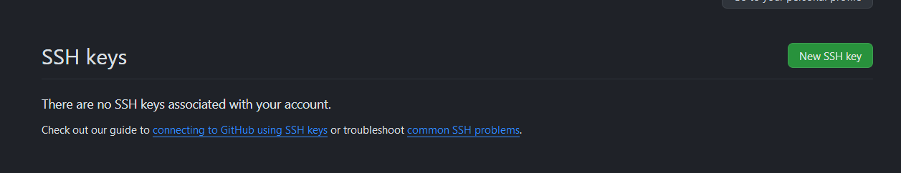
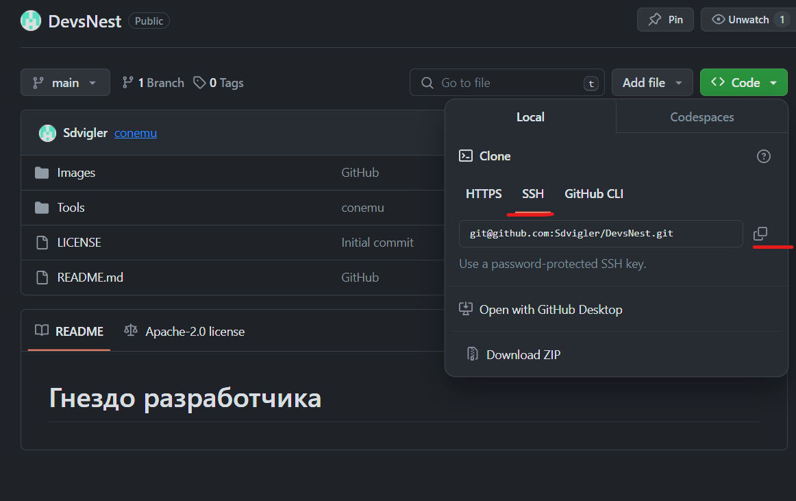

# Установка Git
На странице https://git-scm.com/ скачиваем последнюю версию
Соглашаемся на все настройки по-умолчанию


# GITHUB

GitHub это платформа, которая позволяет разработчикам писать, хранить, управлять и делиться кодом.

## Использование SSH для авторизации

Большой гайд здесь:
https://docs.github.com/ru/authentication/connecting-to-github-with-ssh/about-ssh

```
ssh-keygen -t ed25519 -C "your_email@example.com"
```


> Enter file in which to save the key (/c/Users/YOU/.ssh/id_ALGORITHM):[Press enter]

> Enter passphrase (empty for no passphrase): [Type a passphrase]


Два раза жмем Enter для стандартного создания

## Добавление ключа в GitHub

Ищем файл и копируем его содержимое: 

```
c:\Users\$UserName$\.ssh\id_ed25519.pub
```

Заходим по адресу https://github.com/settings/keys



Нажимаем кнопку New SSH Key.
В название лучше указать имя компьютера с которого вы взяли ключ, а в key скопированное содержимое из файла

Нажимаем Add ssh key 
Ключ создан

## Клонирование проекта

У каждого проекта в корне есть зеленая кнопка Code позволяющая клонировать проект локально

Например попробуем клонировать текущий проект https://github.com/Sdvigler/DevsNest



После нажатия на кнопку копировать, открываем консоль, переходим в папку проектов где хотим создать директорию под новый проект и выполняем следующую команду:

```
    git clone git@github.com:Sdvigler/DevsNest.git
```

В первый раз гит скажет что он не знает такого источника и надо ли его добавить, вам нужно будет набрать в консоле "yes"

Дальше проект создастся


## Основные команды

https://git-scm.com/book/ru/v2/%D0%9F%D1%80%D0%B8%D0%BB%D0%BE%D0%B6%D0%B5%D0%BD%D0%B8%D0%B5-C%3A-%D0%9A%D0%BE%D0%BC%D0%B0%D0%BD%D0%B4%D1%8B-Git-%D0%9E%D1%81%D0%BD%D0%BE%D0%B2%D0%BD%D1%8B%D0%B5-%D0%BA%D0%BE%D0%BC%D0%B0%D0%BD%D0%B4%D1%8B


```
    git add . // добавляет все измившиеся файлы в stage
    git commit "some text for commit" // создает коммит из всех файлы в stage и добавляет комментарий для для коммита
    git push // отправляет изменения в git
    git pull // получает изменния из git
    git branch branchName // создает бранч
    git branch -a // выводит список бранчей

```

# GitHub Flow


Статья описание : https://habr.com/ru/articles/346066/

Для добавления нового функционала мы создаем issue, в котором описываем что нужно сделать

Тэгами мы можем пометить это новый функционал или баг

Дальше в гитхаб есть кнопка создания фичи для Issue, в которой мы этот функционал будем реализовывать.

После завершения работы, мы создаем Pull request и после одобрения, код мержится в мастер и Issue закрывается автоматически


## Source Tree

Удобная утилита для визуализации всех изменений в репозитории.
