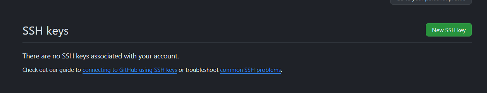

# Установка Git
На странице https://git-scm.com/ скачиваем последнюю версию
Соглашаемся на все настройки по-умолчанию


# GITHUB

GitHub это платформа, которая позволяет разработчикам писать, хранить, управлять и делиться кодом.

## Использование SSH для авторизации

Большой гайд здесь:
https://docs.github.com/ru/authentication/connecting-to-github-with-ssh/about-ssh

```
ssh-keygen -t ed25519 -C "your_email@example.com"
```

>
> Enter file in which to save the key (/c/Users/YOU/.ssh/id_ALGORITHM):[Press enter]
> Enter passphrase (empty for no passphrase): [Type a passphrase]
>

Два раза жмем Enter для стандартного создания

## Добавление ключа в GitHub

Ищем файл и копируем его содержимое: 

```
c:\Users\$UserName$\.ssh\id_ed25519.pub
```

Заходим по адресу https://github.com/settings/keys



Нажимаем кнопку New SSH Key.
В название лучше указать имя компьютера с которого вы взяли ключ, а в key скопированное содержимое из файла

Нажимаем Add ssh key 
Ключ создан

## Клонирование проекта

У каждого проекта в корне есть зеленая кнопка Code позволяющая клонировать проект локально

Например попробуем клонировать текущий проект https://github.com/Sdvigler/DevsNest

